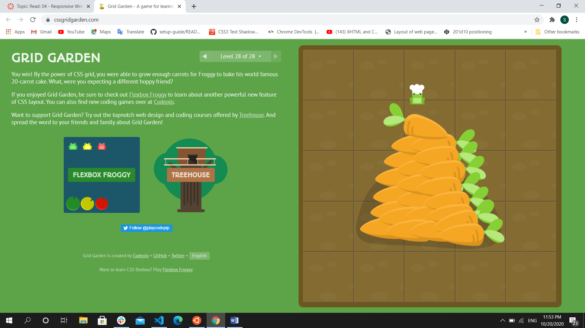

# Read 4
## Regular Expressions

`Regular expressions` (regex or regexp) are extremely useful in extracting information from any text by searching for one or more matches of a specific search pattern. Fields of application range from validation to parsing/replacing strings, passing through translating data to other formats and web scraping. You can use it almost in all programming languages.

`Character classes`

`.`	any character except newline

`\w\d\s`	word, digit, whitespace

`\W\D\S`	not word, digit, whitespace

`[abc]`	any of a, b, or c

`[^abc]`	not a, b, or c

`[a-g]`	character between a & g

`Anchors`

`^abc$`	start / end of the string

`\b\B`	word, not-word boundary

`Escaped characters`

`\.\*\\`	escaped special characters

`\t\n\r`	tab, linefeed, carriage return

`Groups & Lookaround`

`(abc)`	capture group

`\1`	backreference to group #1

`(?:abc)`	non-capturing group

`(?=abc)`	positive lookahead

`(?!abc)`	negative lookahead

`Quantifiers & Alternation`

`a*a+a?	` 0 or more, 1 or more, 0 or 1

`a{5}a{2,}`	exactly five, two or more

`a{1,3}`	between one & three

`a+?a{2,}?`	match as few as possible

`ab|cd`	match ab or cd
## Grids
CSS Grid Layout is the most powerful layout system available in CSS. It is a 2-dimensional system, meaning it can handle both columns and rows, unlike flexbox which is largely a 1-dimensional system. You work with Grid Layout by applying CSS rules both to a parent element (which becomes the Grid Container) and to that element’s children (which become Grid Items).

