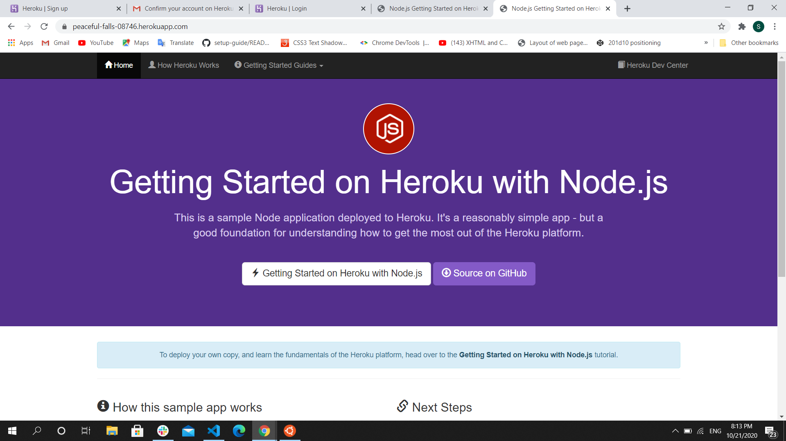
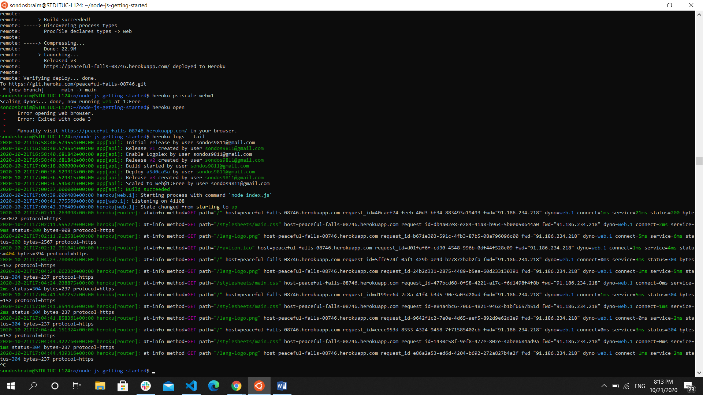

# Deploying Webpages using Node.js and Heroku

Sometimes you will need a way to show your work by deploying it to a server because you can’t share it if you only have the application locally. The simple way to deploy it is by using node.js. First you will make sure that you have node.js and Heroku installed on your device. Then you can follow some steps to deploy a repo and then it will be deployed.

Node allows a server to handle a lot of connections and work with a number of requests at the same time. And you don't need much memory for that. It's designed to be responsive and fast. Just like your web browser! So, it's useful when you need to create an application that will be able to respond instantly to a large number of users. And Node was built from scratch to provide you with such a functionality.

